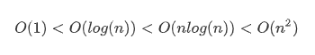
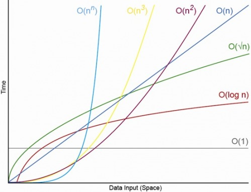
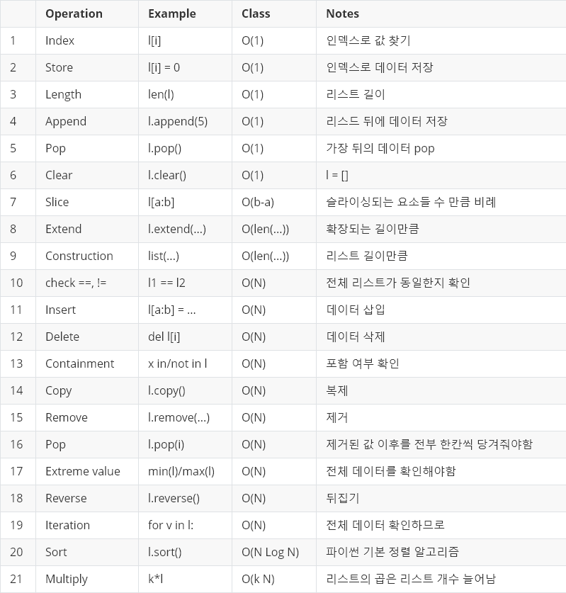
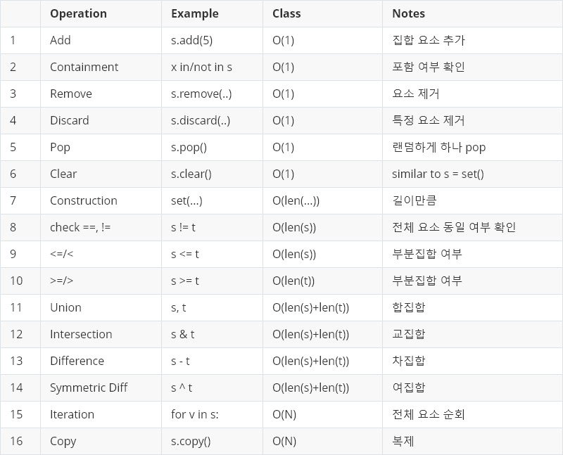
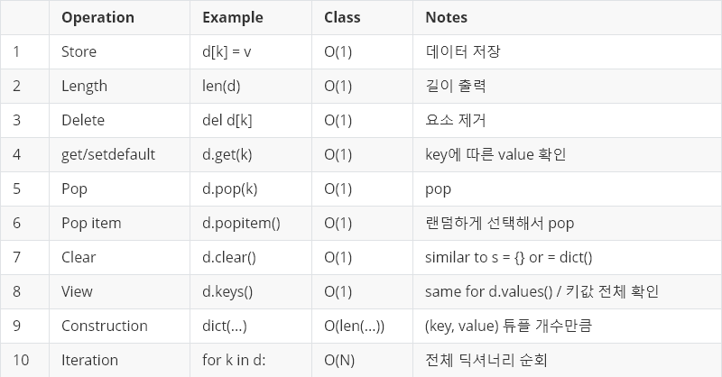

# 시간복잡도

---------------------------------

시간복잡도 = 한마디로 시간이 얼마나 걸리느냐   
파이썬의 기본 산술 연산들은 O(1)으로 즉각적인 결과가 나타난다.

길이가 n인 리스트를 처음부터 끝까지 요소를 하나씩 출력한다면, print함수를 n번 사용하므로 O(1) x n이므로 O(n)이. 이중 for문은 O(n²), 삼중 for문은 O(n³)과 같은 방식으로 진행된다.

* 복잡한 정도

-----------------------------------

## * List

## * Set

## * Dict

--------------------------------------------

### 자료형에 따른 시간 복잡도 비교

List 자료형은 삽입, 제거, 탐색, 포함 여부 확인 모두 O(n)에 해당하는 시간 복잡도를 가지고 있고,

Set과 Dictionary는 삽입, 제거, 탐색, 포함여부확인 연산에 O(1)의 시간 복잡도를 가지고 있다.

탐색과 확인이 주로 필요한 연산이라면 Set이나 Dictionary를 사용하는 것이 좋고 순서와 index에 따른 접근이 필요하다면 List 자료형을 사용하는 것이 좋다.

   

참고 https://chancoding.tistory.com/43