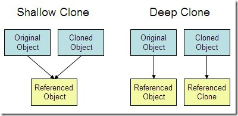

# 얕은 복사(shallow copy)와 깊은 복사(deep copy)

-------------------------------------

* 객체구분표 

|class|설명|구분|
|------|---|---|
|list|mutable 한 순서가 있는 객체 집합|mutable|
|set|mutable 한 순서가 없는 고유한 객체 집합|mutable|
|dict|key 와 value 가 맵핑된 객체, 순서 없음|mutable|
|bool|참, 거짓|immutable|
|int|정수|immutable|
|float|실수|immutable|
|tuple|immutable 한 순서가 있는 객체 집합|immutable|
|str|문자열|immutable|
|frozenset|immutable 한 set|immutable|

-----------------------------------------------

## shallow copy

        import copy
        
        a = [1, [1, 2, 3]]
        b = copy.copy(a)    # shallow copy 발생
        print(b)    # [1, [1, 2, 3]] 출력
        b[0] = 100
        print(b)    # [100, [1, 2, 3]] 출력,
        print(a)    # [1, [1, 2, 3]] 출력, shallow copy 가 발생해 복사된 리스트는 별도의 객체이므로 item을 수정하면 복사본만 수정된다. (immutable 객체의 경우)
        
        c = copy.copy(a)
        c[1].append(4)    # 리스트의 두번째 item(내부리스트)에 4를 추가
        print(c)    # [1, [1, 2, 3, 4]] 출력
        print(a)    # [1, [1, 2, 3, 4]] 출력, a가 c와 똑같이 수정된 이유는 리스트의 item 내부의 객체는 동일한 객체이므로 mutable한 리스트를 수정할때는 둘다 값이 변경됨

* 얕은 복사는 새로운 객체(변수)를 만든 후에 원본에 접근할 수 있는 참조(reference)를 입력한다.
    -  이런 경우 서로 다른 변수명이지만 본질적으로 서로 같은 대상을 의미하므로 하나의 변수 역시 수정이 된다.

* 가변형(mutable) 자료형에 대해서 적용이 가능하다.
    -  가변형(mutable) 자료형은 같은 주소에서 값(value)이 변경 가능하기 때문에 얕은 복사가 가능하다.
    -  불변형(immutable) 자료형은 본질적으로 변경이 불가능하므로 재배정을 통해 변수를 바꾼다. 따라서 재배정이 이루어지므로 객체가 서로 달라진다.

## deep copy
        import copy
        
        a = [1, [1, 2, 3]]
        b = copy.deepcopy(a)    # deep copy 실행
        print(b)    # [1, [1, 2, 3]] 출력
        b[0] = 100
        b[1].append(4)
        print(b)    # [100, [1, 2, 3, 4]] 출력
        print(a)    # [1, [1, 2, 3]] 출력

- 깊은 복사는 새로운 객체(변수)를 만든 뒤에 원본의 복사본을 변수에 입력한다.
  - 서로 값만 같을 뿐 본질적으로 서로 다르기 때문에 한 변수가 수정될 시 다른 변수가 수정되지 않는다.
    
  

    

---------------------------------------------------------------------------

참고
- https://velog.io/@hyoniii_log/PythonShallow-copy-Deep-copy#%EC%96%95%EC%9D%80-%EB%B3%B5%EC%82%AC%EA%B9%8A%EC%9D%80-%EB%B3%B5%EC%82%AC%EC%9D%98-%EC%98%88%EC%A0%9C
- https://blueshw.github.io/2016/01/20/shallow-copy-deep-copy/